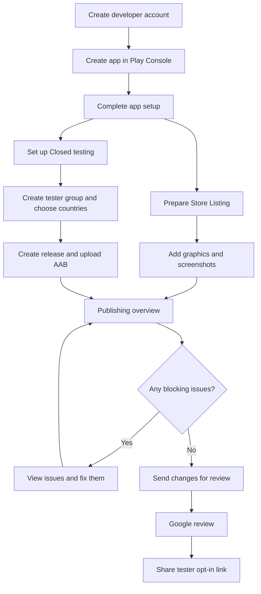

# Google Play Release Process

This document records my first experience preparing and publishing Veilmi
through Google Play Console.

It is written for other first-time developers who may be going through the same
process.

The most confusing part for me was not the Android build itself. It was finding
the correct page in Play Console. Many pages have similar names, and saving a
change is not the same as submitting it for review.

For that reason, this guide focuses on:

- where each task is located;
- which page or button to look for;
- what information belongs there;
- what to check when Play Console blocks the release.

> **Note:** Google Play Console changes over time, and button names may vary
> slightly by language. The paths below match the interface I used for this
> release. Google Help may sometimes use **Main store listing** for the editor
> that my Play Console showed as **Default store listing**.

---

## Quick Flow



The main Play Console areas used in this guide are:

```text
Dashboard
└── App setup checklist

Policy and programs
└── App content

Test and release
└── Testing
    └── Closed testing

Grow users
└── Store presence
    ├── Store listings
    └── Store settings

Publishing overview
└── View issues / Send changes for review
```

---

## 1. Developer Account and Identity Verification

Before I could publish Veilmi on Google Play, I first needed to create a
Google Play Console developer account and complete the required developer
verification.

For a personal developer account, Google may ask for information such as:

- developer name;
- legal name and address;
- contact information;
- developer email address;
- linked Google Payments profile;
- identity verification;
- phone verification.

The basic flow was:

```text
Create developer account
        ↓
Provide developer information
        ↓
Link Google Payments profile
        ↓
Submit identity verification
        ↓
Complete phone verification
        ↓
Continue to Play Console
```

I intentionally do not record document numbers, identification images, account
numbers, passwords, or other private verification information in this public
repository.

For current requirements, see the
[Google Play Console developer identity verification documentation](https://support.google.com/googleplay/android-developer/answer/10841920).

### Developer and Project Identity

While preparing the developer account and Android release, I also had to decide
how Veilmi should identify the developer and the application.

For the signing certificate, I used information such as:

```text
Name:         Noa Jou
Organization: Veilmi
Country:      TW
```

I used **Veilmi** as the organization name because the signing certificate is
associated with this project. It does not mean that Veilmi is a registered
company or legal organization.

The Android application uses this Application ID:

```text
com.veilmi.app
```

An Android Application ID is a unique technical identifier for the app. It is
not the same thing as the developer's personal name or the app name shown to
users.

The structure can be read roughly as:

```text
com . veilmi . app
 │      │      │
 │      │      └── the application
 │      └── the Veilmi project namespace
 └── conventional reverse-domain-style prefix
```

I chose a project-based identifier instead of something such as:

```text
com.noajou.veilmi
```

because I wanted the technical application identity to belong to **Veilmi**
rather than to my personal name.

---

## 2. Create the App in Play Console

From the Play Console home page, go to:

```text
All apps
    ↓
Create app
```

The **Create app** page asks for basic information such as:

```text
App name
Default language
App or game
Free or paid
Contact email
Declarations
```

For Veilmi, I used:

```text
App name:          Veilmi
Default language:  English (United Kingdom) — en-GB
App or game:       App
Free or paid:      Free
```

The Android package name is already defined in the Flutter project:

```text
com.veilmi.app
```

It becomes associated with the Play Console app through the Android build that
is uploaded later.

After creating the app, Play Console opens the app dashboard.

This dashboard is important because it contains the setup checklist used in
later sections.

---

## 3. Prepare the Store Listing

The normal Google Play store page is under:

```text
Grow users
    ↓
Store presence
    ↓
Store listings
```

On the **Store listings** page, find:

```text
Default store listing
```

and click:

```text
Edit default store listing
```

Google Help may also refer to this editor as the **Main store listing**.

Do **not** click **Create custom store listing** just because you want to add
another language. Custom store listings are for targeting special audiences.

### Store Listing text

At the top of the editor, use:

```text
Select language to edit
```

For the default listing, I used:

```text
English (United Kingdom) — en-GB
```

The main text fields are:

```text
App name            up to 30 characters
Short description   up to 80 characters
Full description    up to 4000 characters
```

### A small formatting problem

I added paragraph breaks to the full description.

Some Play Console summary pages later displayed it as one large paragraph.
That did not mean the original formatting had been removed.

To check the real text, return to:

```text
Grow users
    ↓
Store presence
    ↓
Store listings
    ↓
Edit default store listing
```

### Adding Traditional Chinese Store Listings

I also added:

```text
Traditional Chinese (Taiwan) — zh-TW
Chinese (Hong Kong) — zh-HK
```

The confusing part was finding the correct language control.

This page was **not** what I needed:

```text
Translations
    ↓
Store listings and products
    ↓
Create order
```

That page is for translation services.

I also did **not** need:

```text
Create custom store listing
```

To edit normal localized Store Listings, return to:

```text
Grow users
    ↓
Store presence
    ↓
Store listings
    ↓
Edit default store listing
```

Then use the language control at the top of the editor **(the dropdown list)**.

After the languages were added, I could switch between:

```text
en-GB
zh-TW
zh-HK
```

and edit each language separately.

The Taiwan and Hong Kong versions can share most of the same Traditional
Chinese text.

### Store Listing contact details

The public support contact is on a different page:

```text
Grow users
    ↓
Store presence
    ↓
Store settings
    ↓
Store listing contact details
```

This section contains:

```text
Email address   — required
Phone number    — optional
Website         — optional
```

This information may be visible to Google Play users, so use contact details
that are suitable for public support.

---

## 4. Add App Icon, Feature Graphic, and Screenshots

The graphic assets are edited in the same Store Listing editor:

```text
Grow users
    ↓
Store presence
    ↓
Store listings
    ↓
Edit default store listing
```

Continue past the text fields to the graphic asset sections.

### App icon

For my Play Console submission, the Store Listing required a:

```text
512 × 512 px
PNG or JPEG
maximum size: 1 MB
```

My original Veilmi artwork was larger, so I created a separate 512 × 512
version for Google Play.

Click the app icon asset box:

```text
Add assets
```

The asset picker can then show existing assets or let you use options such as:

```text
Upload
Add from Drive
```

### Feature graphic

The feature graphic is separate from the app icon.

The required size shown by Play Console was:

```text
1024 × 500 px
PNG or JPEG
```

It is a horizontal promotional image.

### Phone screenshots

In the same Store Listing editor, find and expand:

```text
Phone assets
    ↓
Phone screenshots
```

I uploaded real screenshots of Veilmi and dragged them into the order I wanted.

My sequence was:

```text
1. Encrypt before
2. Encrypt after
3. Decrypt before
4. Decrypt after
5. Protection settings
6. Protection & Device Check
7. About Veilmi
```

**Please drag the photos to the correct positions in order. Although it's not very obvious, you can adjust it.**

Play Console also showed separate asset sections for:

```text
Tablet
Chromebook
Android XR
```

Those are separate from the phone screenshots.

### Localized screenshots

When editing a translated Store Listing, Play Console may initially show
graphics inherited from the default language.

To add localized graphics:

```text
Edit default store listing
    ↓
Select language to edit
    ↓
Choose zh-TW or zh-HK
    ↓
Go to the graphic asset section
```

**Simply add photos, and they will replace the grayed-out ones. That's how you get started.**

For Veilmi, the Taiwan and Hong Kong Store Listings can use the same
Traditional Chinese app screenshots because the app uses the same Traditional
Chinese interface.

---

## 5. Add the Privacy Policy

During first-time setup, the easiest place to find this task is:

```text
Dashboard
    ↓
Provide app information and set up your store listing
    ↓
Privacy Policy
```

Open the task and enter a publicly accessible Privacy Policy URL.

For Veilmi:

```text
https://noa-jou.github.io/Veilmi/privacy-policy/
```

Save the form and return to the Dashboard checklist.

---

## 6. Complete App Content and Data Safety

This was one of the easiest parts to lose track of because Play Console asks for
several declarations.

For a first release, the simplest place to find the unfinished tasks is:

```text
Dashboard
    ↓
Provide app information and set up your store listing
```

The checklist may include items such as:

```text
Privacy Policy
App access
Ads
Content rating
Target audience
Data safety
Government apps
Financial features
Health
```

Open each unfinished item, answer the questions according to what the app
actually does, save it, and return to the checklist.

Even when something does not apply to the app, the form may still need to be
opened and completed.

### If the checklist item is already completed

After a declaration has been completed, it may be easier to reopen it from:

```text
Policy and programs
    ↓
App content
```

This page contains declarations such as App access, Target audience,
Financial features, and other app-content information.

### Content rating

The first-time setup checklist also links to:

```text
Content rating
```

The form asks for a contact email, an application category, and the IARC
questionnaire.

For Veilmi, I selected:

```text
All other app types
```

rather than **Social or communication**, because Veilmi works alongside
messaging apps but does not provide its own messaging or social network.

Complete the questionnaire and submit it.

### Advertising ID

The Advertising ID declaration appeared later as a blocking issue.

I found it through:

```text
Publishing overview
    ↓
View issues
    ↓
Advertising ID declaration incomplete
    ↓
Fill in declaration form
```

Complete the form according to whether the app or any included SDK uses the
Android Advertising ID, save it, and return to **Publishing overview**.

This declaration is separate from the normal **Ads** declaration.

---

## 7. Set Up the Closed Testing Track

For new personal developer accounts, Google Play may require Closed Testing
before Production access becomes available.

Go to:

```text
Test and release
    ↓
Testing
    ↓
Closed testing
```

Create a new track and give it a name.

For Veilmi, I used:

```text
Veilmi Closed Test
```

Open the track. The main sections are:

```text
Countries / regions
Testers
Releases
```

### Countries / regions

Open:

```text
Closed testing
    ↓
Veilmi Closed Test
    ↓
Countries / regions
```

Choose where the test should be available and save the change.

This only controls the Closed Test. It does not publish the app to Production.

### Testers

Open:

```text
Closed testing
    ↓
Veilmi Closed Test
    ↓
Testers
```

Play Console lets you use an email list or a Google Group.

I used a Google Group:

```text
Veilmi Testers
veilmi-testers@googlegroups.com
```

### Create the Google Group First

The Google Group must be created separately in Google Groups.

Go to:

```text
Google Groups
    ↓
Create group
```

Create the group, choose the membership and privacy settings, and save it.

Then return to:

```text
Play Console
    ↓
Closed testing
    ↓
Veilmi Closed Test
    ↓
Testers
    ↓
Google Groups
```

Enter the real Google Group email address and save it.

> **Important:** Play Console does not create the Google Group for you.

I first entered the group address before creating the group, so Play Console
reported that the group did not exist.

The correct order is:

```text
Create Google Group
        ↓
Return to Play Console
        ↓
Add it under Testers
        ↓
Save
```

### Feedback and Tester Link

On the **Testers** page, also provide a feedback email or URL.

The Google Group controls who is eligible for the test. The feedback address is
where testers can contact you.

The tester opt-in link may not appear until the Closed Testing release becomes
available.

Later, return to:

```text
Closed testing
    ↓
Veilmi Closed Test
    ↓
Testers
```

and copy the tester link.

For a Google Group test, testers normally need to:

```text
Join the Google Group
        ↓
Open the tester link
        ↓
Opt in to the Closed Test
```

---

## 8. Upload the Signed Android App Bundle

Open the closed-testing track:

```text
Test and release
    ↓
Testing
    ↓
Closed testing
    ↓
Veilmi Closed Test
    ↓
Releases
```

Click:

```text
Create new release
```

This opens the closed-testing release editor.

Upload the signed Android App Bundle:

```text
build/app/outputs/bundle/release/app-release.aab
```

Google Play reads the bundle and displays information such as:

```text
Version code
Version name
Minimum Android version / API
Target SDK
```

For this release, the bundle showed:

```text
Version code: 1
Version name: 1.0.0
Minimum API: 24+
Target SDK: 36
```

Play Console also generated an internal release name similar to:

```text
1 (1.0.0)
```

I kept the generated release name.

---

## 9. Add Release Notes and Save the Release

On the same release editor, scroll to:

```text
Release notes
```

The release notes can contain more than one language.

For example:

```text
<en-GB>
Initial closed testing release of Veilmi.

- Local text encryption and decryption.
- Selectable protection levels.
- Device Check.
- English and Traditional Chinese interface.
</en-GB>

<zh-TW>
Veilmi 首次封閉測試版本。

- 本機文字加密與解密。
- 可選擇不同的保護等級。
- Device Check。
- 支援英文與繁體中文介面。
</zh-TW>
```

Release-note languages and Store Listing languages are separate settings.

For example:

```text
2 languages provided
```

on the release page only means that two release-note languages were added. It
does not mean that two localized Store Listings already exist.

When the bundle and release notes are ready, click:

```text
Save
```

Play Console may then ask whether you want to go to:

```text
Publishing overview
```

Going there is safe. It does not automatically publish the app.

---

## 10. Submit for Review

Open:

```text
Publishing overview
```

This page collects changes that have been saved but not yet submitted.

Two important beginner rules are:

```text
Save
≠
Send for review
```

and:

```text
Opening Publishing overview
≠
Publishing the app
```

I accidentally opened Publishing overview before I was ready. Nothing was
published. I could simply leave the page and continue editing.

### If the Send button is disabled

Look for a red issue box and click:

```text
View issues
```

Play Console will show what is blocking the submission.

Examples I encountered included incomplete app information and the Advertising
ID declaration.

The issue may contain a direct action such as:

```text
Fill in declaration form
```

Fix the problem, save it, and return to:

```text
Publishing overview
```

Repeat this until there are no blocking issues.

### Send the changes

When everything is ready, the blue submission button becomes available.

In my first submission it said:

```text
Send 15 changes for review
```

The number is not important. It simply reflects how many saved changes are
waiting to be submitted.

Click the button.

Play Console then shows a confirmation dialog such as:

```text
Send 15 changes for review?
```

Confirm with:

```text
Send changes for review
```

After submission, Publishing overview changes from something like:

```text
Changes not yet submitted
```

to:

```text
Changes in review
```

For a Closed Testing release, this sends the closed-test release and related
changes to Google for review.

It does **not** make the app a public Production release.

---

## 11. What Happens After Submission

After the changes are submitted, there is nothing else to press immediately.

To check the review state, return to:

```text
Publishing overview
```

When the Closed Testing release becomes available, return to:

```text
Test and release
    ↓
Testing
    ↓
Closed testing
    ↓
Veilmi Closed Test
    ↓
Testers
```

Copy the tester opt-in link.

For the Google Group flow, a tester needs to:

```text
Join the Google Group
        ↓
Open the Google Play tester link
        ↓
Opt in to the Closed Test
        ↓
Install the app from Google Play
        ↓
Test the app and send feedback
```

For new personal developer accounts covered by Google's testing requirement,
at least 12 testers must remain opted in continuously for at least 14 days
before Production access can be requested.

After the requirement is met, go to:

```text
Dashboard
    ↓
Apply for production
```

and complete the Production access application.

---

## Troubleshooting: Where Should I Look First?

If I am lost in Play Console, I use this map.

```text
Missing setup information?
→ Dashboard
→ App setup checklist
```

```text
Need to reopen a policy declaration?
→ Policy and programs
→ App content
```

```text
Need to edit the public Store Listing?
→ Grow users
→ Store presence
→ Store listings
→ Edit default store listing
```

```text
Need to change support email or website?
→ Grow users
→ Store presence
→ Store settings
→ Store listing contact details
```

```text
Need to change countries, testers, or the testing release?
→ Test and release
→ Testing
→ Closed testing
→ Open / Manage the track
```

```text
Google Group is rejected as a tester group?
→ Open Google Groups
→ Make sure the group actually exists
→ Check that your account can access/manage it
→ Return to Closed testing → Testers
```

```text
Cannot submit?
→ Publishing overview
→ View issues
```

```text
Ready to submit?
→ Publishing overview
→ Send changes for review
```

This simple map is much easier to use than trying to remember every Play
Console page at once.

---

## Useful Official Google Play Documentation

- [Create and set up your app](https://support.google.com/googleplay/android-developer/answer/9859152)
- [Set up an open, closed, or internal test](https://support.google.com/googleplay/android-developer/answer/9845334)
- [Testing requirements for new personal developer accounts](https://support.google.com/googleplay/android-developer/answer/14151465)
- [Control when app changes are reviewed and published](https://support.google.com/googleplay/android-developer/answer/9859654)
