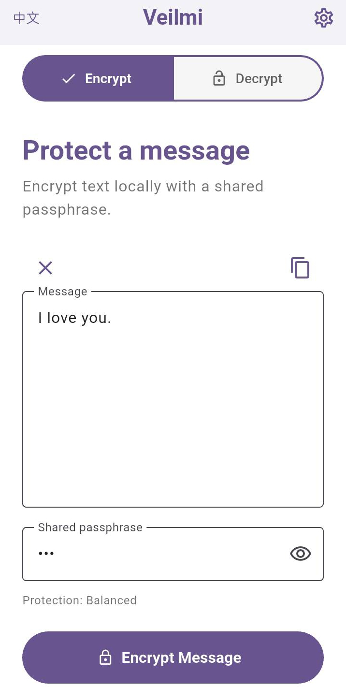
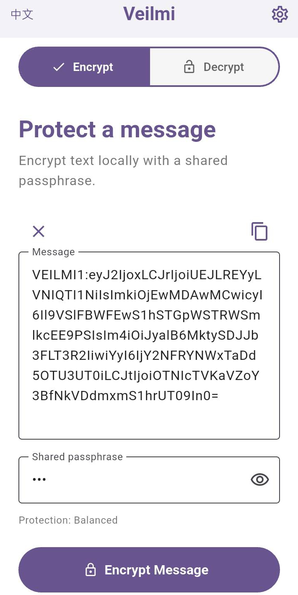
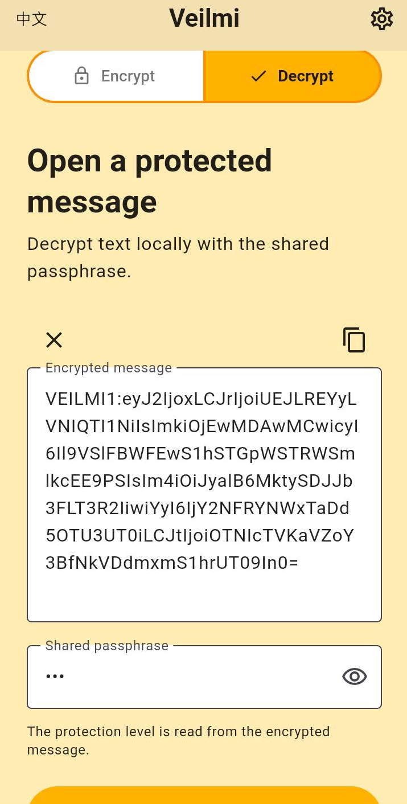
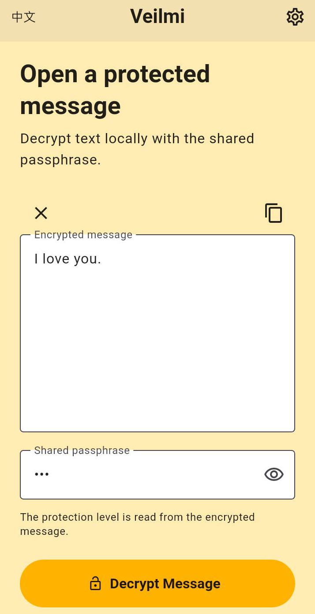
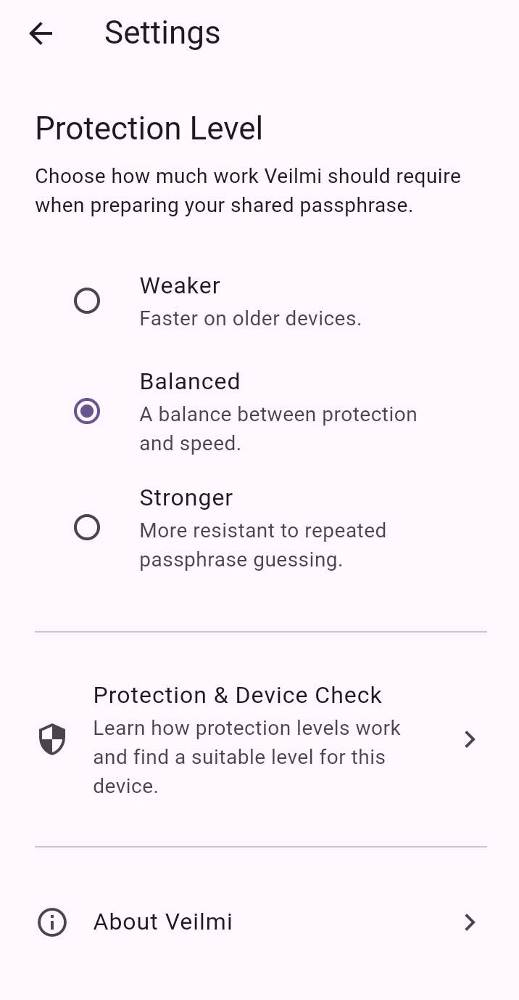
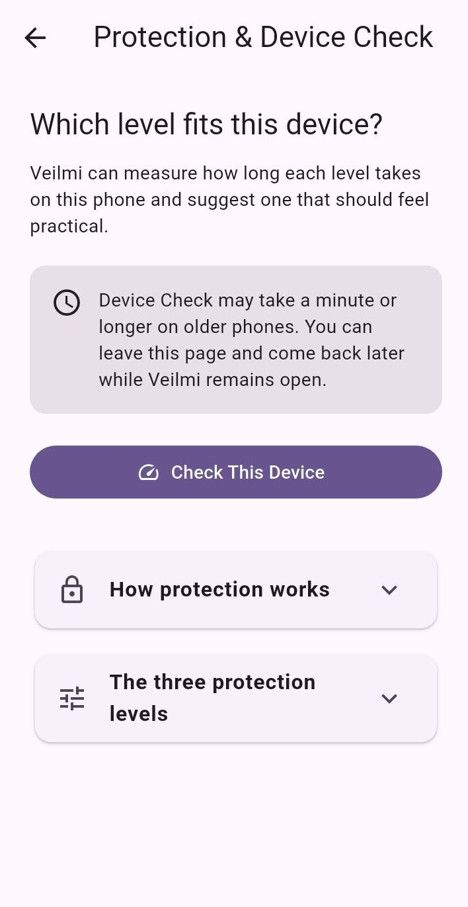
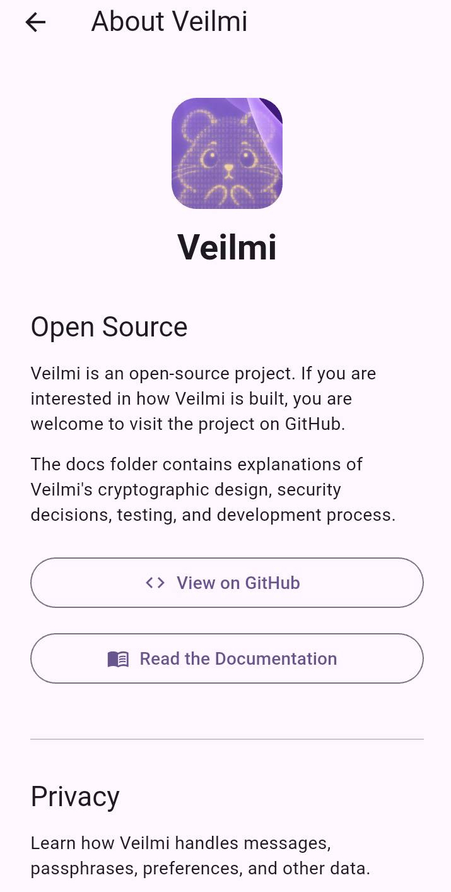

# Veilmi Usage Guide

[中文](usage-guide.zh.md)

This page provides a visual walkthrough of Veilmi's main screens and core workflow.

## 1. Protect a Message

Enter the message you want to protect and the shared passphrase.

  

## 2. Create a Protected Message

Tap **Encrypt Message** to encrypt the plaintext locally.

Veilmi replaces the plaintext with a `VEILMI1:XXXXXX` protected message.

The result can then be copied and sent through another communication tool.

  

## 3. Open a Protected Message

The recipient can paste the `VEILMI1:XXXXXX` protected message into Veilmi's
**Decrypt** mode and enter the shared passphrase.

  

## 4. Recover the Original Message

Tap **Decrypt Message** to decrypt the protected message locally.

If the protected message and passphrase are valid, Veilmi displays the
original plaintext.

  

## 5. Adjust Protection Levels

### If encryption or decryption takes too long

Tap the **gear icon** in the top-right corner to open the Settings page.

  

Before changing the protection level, you can learn more about it in
**Protection & Device Check**.

You can also visit **About Veilmi** to find more information and documentation
about the app.

## 6. Protection & Device Check

**Device Check** benchmarks Veilmi's protection levels on the current device
and helps you choose a practical balance between protection and performance.

The benchmark runs locally on the device.

  

## 7. About Veilmi

The **About Veilmi** page provides direct access to project information,
including:

- the open-source GitHub repository
- Veilmi documentation
- the Privacy Policy
- project support information

  

---

For technical details about Veilmi's cryptographic design, threat model,
localization, Android testing, and release process, etc. See the
[Veilmi documentation website](https://noa-jou.github.io/Veilmi/).