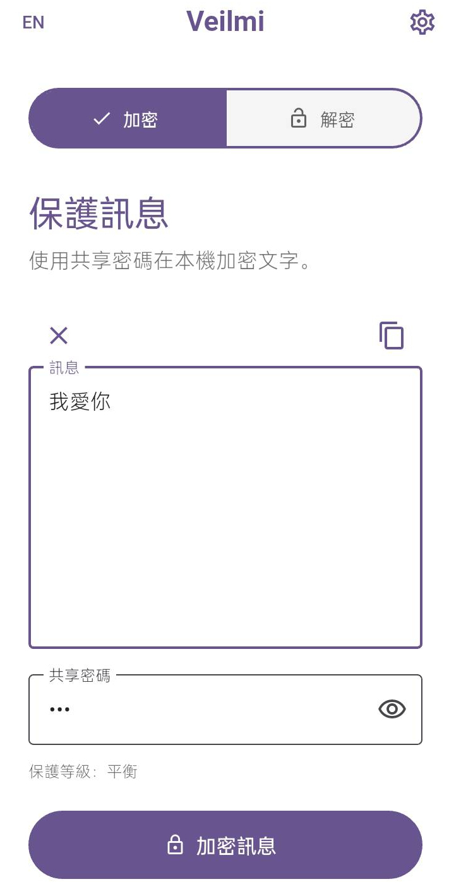
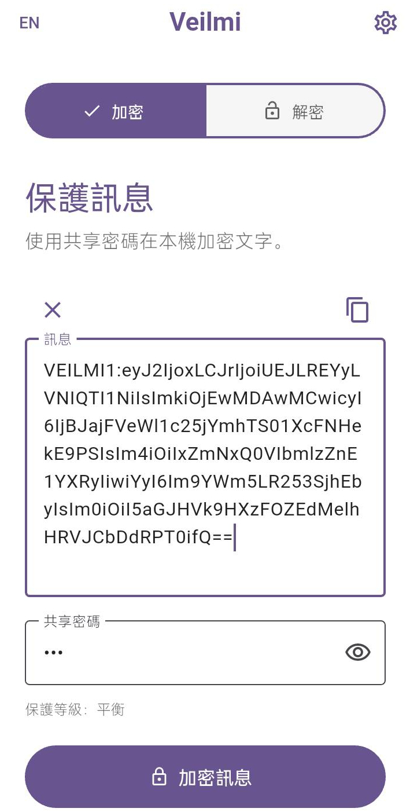
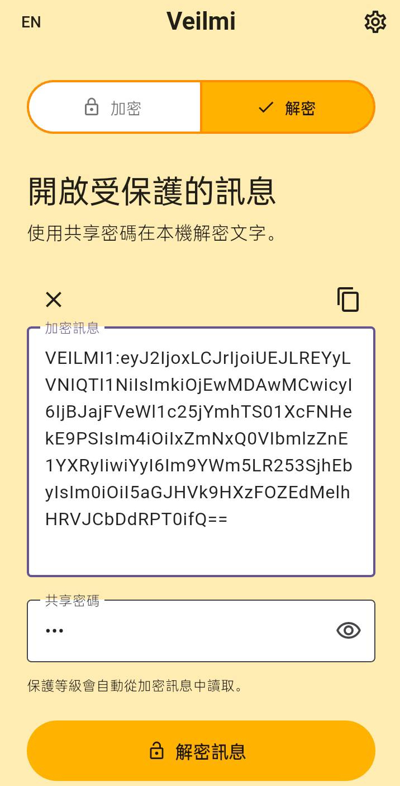
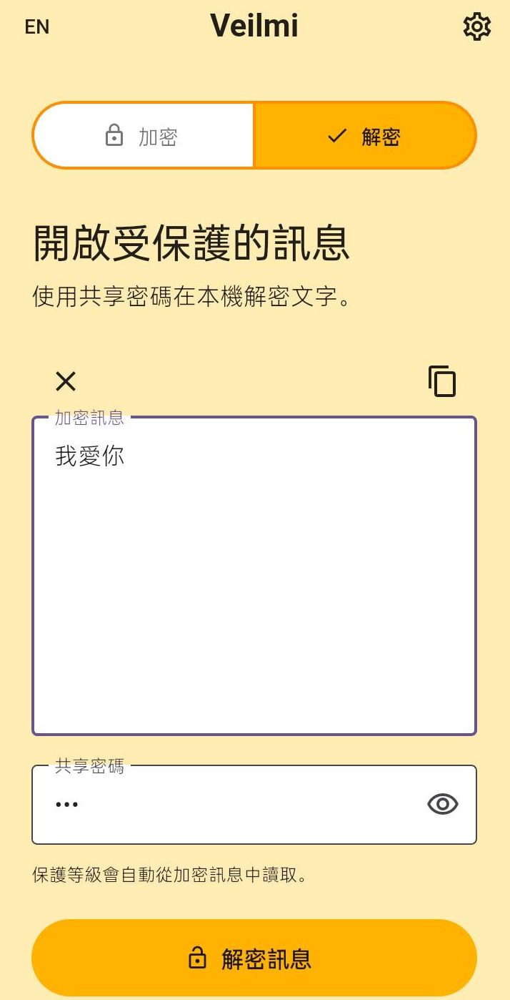
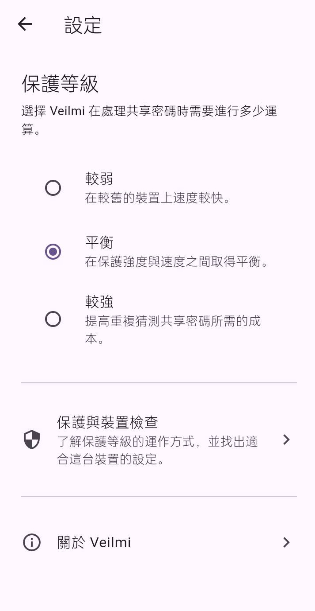
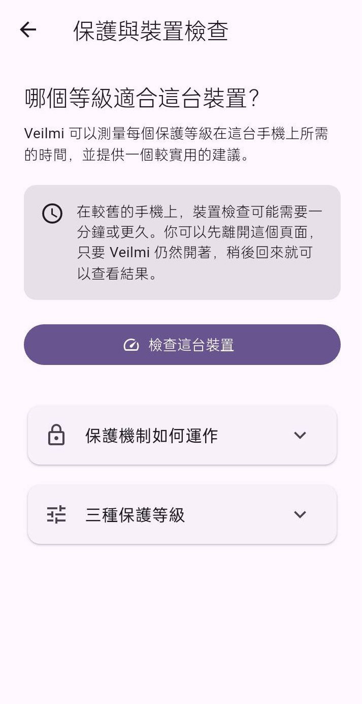
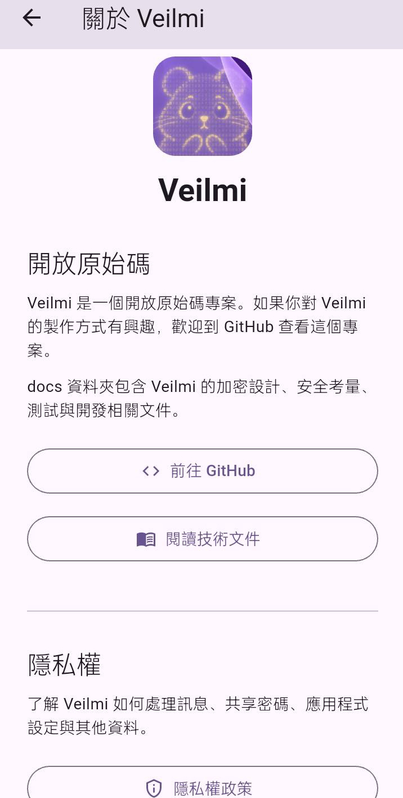

# Veilmi 使用說明

[English](usage-guide.md)

本頁透過 Veilmi 的實際畫面，簡單介紹主要功能與基本使用流程。

## 1. 保護訊息

輸入想要保護的訊息，以及雙方事先約定的共享密碼。

  

## 2. 建立受保護的訊息

點選 **加密訊息**，Veilmi 會在裝置本機加密原始文字。

原始文字會被替換成以 `VEILMI1:XXXXXX` 開頭的受保護訊息。

完成後，可以複製這段內容，再透過其他通訊工具傳送。

  

## 3. 開啟受保護的訊息

收件者可以把收到的 `VEILMI1:XXXXXX` 受保護訊息貼到 Veilmi 的
**解密**模式，並輸入雙方事先約定的共享密碼。

  

## 4. 還原原始訊息

點選 **解密訊息**，Veilmi 會在裝置本機解密受保護的訊息。

如果受保護訊息與共享密碼有效，Veilmi 就會顯示原始文字。

  

## 5. 調整保護等級

### 如果加密或解密所需的時間太長

點選右上角的 **齒輪圖示**，進入設定頁面。

  

在更改保護等級之前，可以先到 **保護與裝置檢查** 了解不同設定。

你也可以前往 **關於 Veilmi**，查看更多關於應用程式的資訊與文件。

## 6. 保護與裝置檢查

**裝置檢查**會在目前的裝置上測試 Veilmi 的不同保護等級，
協助你在保護強度與效能之間選擇實際可用的設定。

測試會在裝置本機執行。

  

## 7. 關於 Veilmi

**關於 Veilmi** 頁面提供專案相關資訊的入口，包括：

- 開放原始碼 GitHub repository
- Veilmi 文件
- 隱私權政策
- 專案支持資訊

  

---

如需了解 Veilmi 的密碼學設計、威脅模型、本地化、Android 測試與
發佈流程等等，請參閱
[Veilmi 文件網站](https://noa-jou.github.io/Veilmi/)。